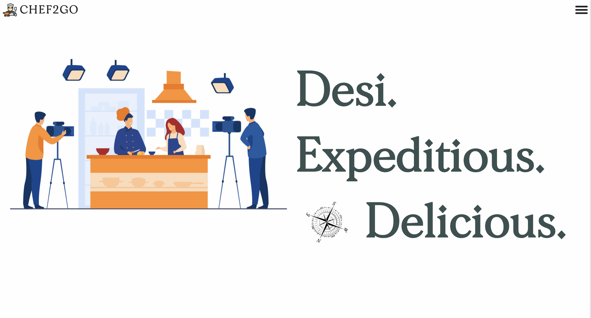

# Chef2Go — Student Meal & Recipe Platform

Chef2Go is a student-focused platform to discover recipes, order chef-curated meals, and access premium recipe videos. Built as a four-person team final project (INFO 6150, Fall 2023).



## Features

- Student authentication (signup/login) with bcrypt-hashed passwords and token-based sessions
- Search by chef and by recipe
- Premium subscription for video content (Stripe)
- REST APIs for recipes, chefs, ingredients, search, payments, and user management

## Tech stack

- **Frontend:** React (TypeScript, Create React App) — `chef-2-go-frontend/`
- **Backend:** Node.js, Express, MongoDB (Mongoose) — `chef-2-go-backend/` (controllers, services, routes, models)
- **Other:** Stripe, Nodemailer

## Running locally

```bash
git clone https://github.com/basupatil1213/chef-2-go.git
cd chef-2-go

# backend
cd chef-2-go-backend
npm install
npm start          # nodemon server.js

# frontend (in a second terminal)
cd chef-2-go-frontend
npm install
npm start
```

The backend reads its configuration (e.g. `MONGOCLOUDURL`, `JWT_SECRET`, `PORT`) from a `.env` file in `chef-2-go-backend/`.

## API overview

### User API

- `POST /signup` — sign up a new user (requires name, username, email, and password)
- `POST /login` — log in with username or email and password
- `DELETE /:id` — delete a user by ID

Error handling:

- Validation errors (e.g. empty fields, invalid email) return `400` with an error message
- Unauthorized requests return `401` with `"Unauthorized"`
- Internal server errors return `500` with `"Internal Server Error"`

### Ingredient API

Manages ingredients and the stores where they are available. It follows a layered structure: schema (`ingredient-model.js`), CRUD logic (`ingredient-service.js`), request handling (`ingredient-controller.js`), and routes (`ingredient-route.js`).

## Object model


## Team

- [@Basavaraj Patil](https://github.com/basupatil1213)
- [@Bhuvan Dama Venkatesh Raj](https://github.com/BhuvanDV)
- [@Keerthana Mikkili](https://github.com/keerthanamikkili)
- [@Shreyas Hanamantgouda Patil](https://github.com/shreyes-patil)
